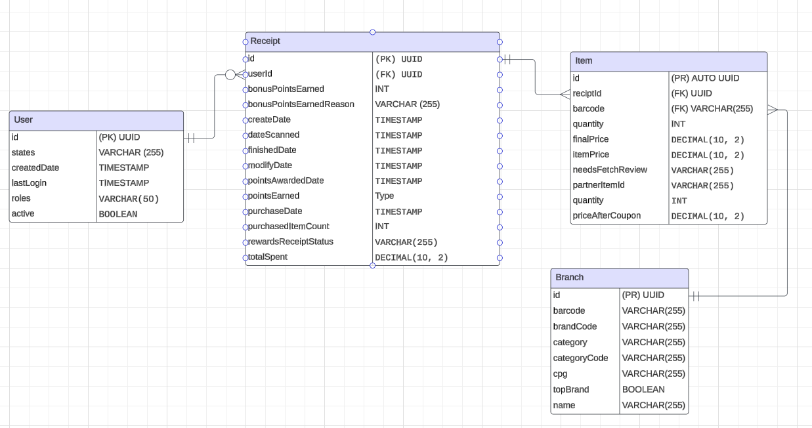

# Fetch-Rewards-Coding-Exercise
 
### First: Review Existing Unstructured Data and Diagram a New Structured Relational Data Model

### Second: Write queries that directly answer predetermined questions from a business stakeholder

All queries that relate to the answers below in `./queries` please check. 

* What are the top 5 brands by receipts scanned for most recent month?

    * The top 5 brands are "Pepperidge Farm", "Prego", "Jell-O", "V8", "Cheetos"    

* When considering average spend from receipts with 'rewardsReceiptStatus’ of ‘Accepted’ or ‘Rejected’, which is greater?

    * Accpted is greater

* When considering total number of items purchased from receipts with 'rewardsReceiptStatus’ of ‘Accepted’ or ‘Rejected’, which is greater?

    * Accpted is greater

* Which brand has the most spend among users who were created within the past 6 months?

    *  Cracker Barrel Cheese

* Which brand has the most transactions among users who were created within the past 6 months?
    * Swanson

### Third: Evaluate Data Quality Issues in the Data Provided

The data preprocessing, injection, and evaluation can find in `./action/Data_Qulity_and_Injection.ipynb`

### Fourth: Communicate with Stakeholders

Hi [Product/Business Leader's Name],

I hope this message finds you well. As part of our ongoing analysis to understand brand performance and customer engagement, I’ve been working on extracting key insights from our receipt and transaction data. I wanted to share some preliminary findings and discuss a few observations regarding data quality and potential improvements.

First, I have few question about the data. What is the primary difference int eh intende use between? Are there any standard practices or guidelines for barcode recording and validation? Are there any handbooks that demonstrate where these data coming from and what's columns meaning? 

Second, there's coupon issues that I found during the data cleaning and preprocessing. There's Inconsistent results when anlyzing time-based trends highlighted discrepancies between "createdDate" and "dataScanned". Missing joins and incomplete data in brand and item matching due to barcode mismatches. Missing incomplete data in receipt that some of receipt can't find the related client in the user json.

Third, to clarify the questions, Can we confirm the correct usage of 'createdDate' v.s. 'dataScanned' for time-based analysis? Understanding this will help standardize our queries. What mearsures can we implement to ensure barcodes are consistantly recorded across all datasets? Consistency here is curcial for accurate brand and item matching. 

Fourth, to further optimize our data assests, access to customer feedback and loyalty program data would be beneficial. This would allow us to correlate spend with customer satisfaction and loyalty metris.

Fifth, there's few things that we need to include for the performance and scaling. First, query optimization, ensure our queries are optimized for performance by indexing key columns and using efficient joins to handle large datasets. Second, assessing the current data storage solutions to ensure they can hanlde increased load and concurency as more users and transactions are recorded. Third, real-time processing, exploring real-time data processing tools to provide up-to-date insights, which wilb e crucial for making timely business decisions. 

I look forward to discussing these points further and aligning on the next steps to enhance our data analysis capabilities. Thank you for your attention, and I’m happy to provide more details or answer any questions you might have.

Best regards,

Zhirui Jiang